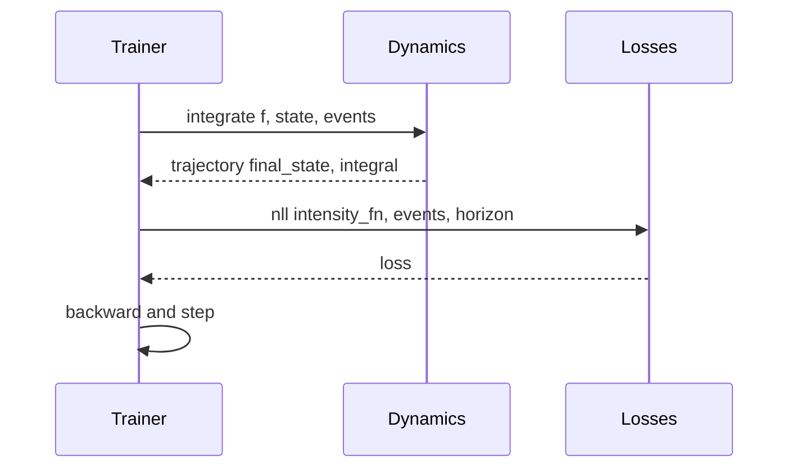
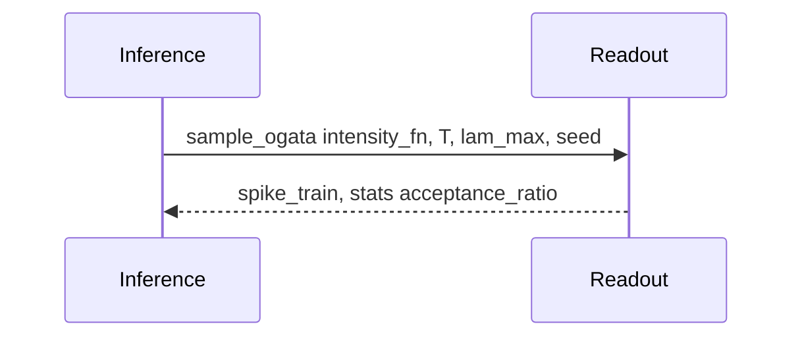

# API Specification - sr-ciden

This document defines the intended public API surface for sr-ciden. It specifies the callable contracts, inputs/outputs, batching, determinism, and performance considerations. These are documentation-only specifications; implementations will follow. Training and inference are strictly decoupled: readout APIs never participate in backpropagation.

Abbreviations used:
- B: batch size
- H: hidden state dimension
- K: number of marks (event types)
- T: horizon (scalar per sequence)
- dtypes default to float32 unless noted
- Devices: cpu or cuda

## API index and module locations

- Core continuous-time integration:
  - [integrate(f, state, events)](src/sr_ciden/dynamics.py:1)
- Likelihood:
  - [nll(intensity_fn, events, horizon)](src/sr_ciden/losses.py:1)
- Readout:
  - [sample_ogata(intensity_fn, T, lam_max, seed)](src/sr_ciden/readout.py:1)
  - [sample_bernoulli(intensity_fn, T, dt, seed)](src/sr_ciden/readout.py:1)
- Validation:
  - [time_rescaling_test(intensity_fn, events)](src/sr_ciden/validation.py:1)
- PyTorch adapters (Phase 1) in [src/sr_ciden/adapters/torch.py](src/sr_ciden/adapters/torch.py):
  - [CIDENCoreTorch.reset_state(batch_size, device)](src/sr_ciden/adapters/torch.py:1)
  - [CIDENCoreTorch.forward(x_t, dt)](src/sr_ciden/adapters/torch.py:1)
  - [CIDENCoreTorch.event_update(x_i)](src/sr_ciden/adapters/torch.py:1)
  - [SRReadoutTorch.forward(lam_t, dt)](src/sr_ciden/adapters/torch.py:1)
- JAX/diffrax stubs (Phase 2) in [src/sr_ciden/adapters/jax.py](src/sr_ciden/adapters/jax.py):
  - [CIDENCoreJAX.reset_state(batch_size, device)](src/sr_ciden/adapters/jax.py:1)
  - [CIDENCoreJAX.step(x_t, dt, state)](src/sr_ciden/adapters/jax.py:1)
  - [SRReadoutJAX.sample_ogata(params, T, lam_max, seed)](src/sr_ciden/adapters/jax.py:1)

All file paths above are module locations only; concrete line numbers will be updated once implementations land.

---

## Core integration

### [integrate(f, state, events)](src/sr_ciden/dynamics.py:1)

- Purpose
  - Evolve hidden state h(t) under a Neural ODE core between event times and apply differentiable jump updates at events.
  - Training context: provides augmented integral of the intensity for exact TPP likelihood.
  - Inference context: may be used for diagnostics or deterministic rollouts independent of readout.

- Inputs
  - f: vector field callable providing dh/dt = f(t, h, context). Library-agnostic; may close over parameters.
    - Signature expectations: t: scalar float, h: [B, H] tensor, context may include per-sequence constants; returns dh/dt with shape [B, H].
  - state: initial hidden state h0 with shape [B, H], dtype float32, device cpu or cuda.
  - events: batch container of variable-length sequences, each containing:
    - times: strictly increasing float tensor [N_i], 0 < t_1 < ... < t_{N_i} <= T_i
    - marks (optional): int tensor [N_i] with values in {0..K-1}
    - horizon T_i: scalar float
  - options (config object or kwargs; may be part of a future wrapper):
    - solver: autodetected library (prefer torchdiffeq) or fixed-step fallback
    - adjoint: bool, enable adjoint gradients if torchdiffeq present
    - rtol/atol or dt for fixed-step RK4/Euler

- Returns
  - trajectory: conceptual object with fields:
    - final_state: h(T_i) with shape [B, H]
    - integral: ∫ lambda*(t) dt over [0, T_i] for each sequence, shape [B]
    - sample_times: optional dense time samples used for diagnostics, ragged per sequence
  - No autograd requirement for readout; during training, autograd tracks through ODE and jump updates.

- Error conditions
  - Non-monotonic event times, negative times, or t beyond horizon.
  - NaN or Inf encountered in dynamics or intensity function.
  - Incompatible batch sizes or device mismatches.

- Determinism
  - ODE integration is deterministic given the same solver, tolerances, and initial conditions.
  - When using adaptive solvers, tolerances affect path but remain deterministic.

- Performance notes
  - Adjoint trades extra time for reduced peak memory; direct backprop uses more memory but can be faster for short sequences.
  - Batch sequences should be grouped by similar horizons to improve solver efficiency.
  - Minimize padding; support ragged batches via lists or packed representations.

---

## Likelihood

### [nll(intensity_fn, events, horizon)](src/sr_ciden/losses.py:1)

- Purpose
  - Compute continuous-time negative log-likelihood for temporal point processes using integral of intensity and sum of log intensities at event times.
  - Provides a discrete fallback when using fixed Δt trajectories.

- Usage context
  - Training only. Inference should not call nll.

- Inputs
  - intensity_fn: callable returning lambda*(t) (and optionally mark-conditioned intensities) evaluated at given times.
    - For marked processes, accepts (t, m) and returns lambda_m(t). For unmarked, returns scalar lambda(t).
  - events: as in integrate: batch of variable-length sequences with times and optional marks.
  - horizon: per-sequence scalar T_i if not embedded in events container.
  - options:
    - reduction: one of {'mean','sum','none'} applied over batch
    - discrete_fallback: if true, uses discrete NLL with Δt when trajectories are discretized
    - eps: small positive clamp to stabilize log intensities

- Returns
  - loss: scalar (if reduced) or [B] vector; additionally may return a dict with {'integral': [B], 'sum_logs': [B]} for diagnostics.

- Error conditions
  - Non-positive intensities after activation; NaN/Inf values.
  - Mismatch between marks and intensity outputs for marked processes.

- Determinism
  - Deterministic given deterministic integration and intensity function; random components are disallowed during training.

- Performance notes
  - Computing intensities in batches at event times is recommended for cache locality.
  - Augmented ODE avoids separate quadrature passes for integrals.

---

## Readout

### [sample_ogata(intensity_fn, T, lam_max, seed)](src/sr_ciden/readout.py:1)

- Purpose
  - Sample spike trains in continuous time using Ogata’s thinning (supports marks). Never backpropagates through samples.

- Usage context
  - Inference and validation only; not part of the training graph.

- Inputs
  - intensity_fn: callable for forward-only evaluation of lambda*(t) and mark probabilities at arbitrary t.
    - Must be side-effect free and accept scalar/batched t; returns scalar lambda or per-mark vector.
  - T: horizon scalar; if batched, call per sequence.
  - lam_max: global or per-sequence conservative upper bound on intensity; can be scalar or callable bound estimator.
  - seed: integer seed (framework-agnostic); implementers must route to framework Generators.

- Returns
  - spike_train: list of (t, m) pairs (m=0 for unmarked).
  - stats: dict including accepted, proposed, acceptance_ratio in [0,1].

- Error conditions
  - lam_max ≤ 0 or invalid bound leading to acceptance probability greater than 1.
  - intensity_fn returning negative or NaN values.

- Determinism
  - Fully deterministic given seed and device; CPU/GPU parity required.

- Performance notes
  - Tight lam_max improves acceptance_ratio and reduces compute.
  - Vectorize across sequences when lam_max is similar.

### [sample_bernoulli(intensity_fn, T, dt, seed)](src/sr_ciden/readout.py:1)

- Purpose
  - Discrete-time fallback sampler using Bernoulli with p(t) = 1 - exp(-lambda*dt).

- Usage context
  - Inference and validation when continuous-time readout is infeasible or to compare against thinning.

- Inputs
  - intensity_fn: as above, forward-only.
  - T: horizon scalar.
  - dt: step size; smaller dt approaches continuous-time.
  - seed: integer seed.

- Returns
  - spike_train: list of (t, optional m) at grid points.

- Determinism
  - Fully deterministic given seed and dt.

- Performance notes
  - Throughput scales inversely with dt; choose dt to balance fidelity and speed.

---

## Validation

### [time_rescaling_test(intensity_fn, events)](src/sr_ciden/validation.py:1)

- Purpose
  - Apply the Time-Rescaling Theorem: transform inter-arrival times via integrated intensity and perform a K–S test against Exp(1) or Uniform(0,1) after mapping.

- Usage context
  - Validation and diagnostics; never used in training loss.

- Inputs
  - intensity_fn: forward-only callable for lambda*(t).
  - events: ground-truth event sequences (times and marks if applicable). Marks allow per-class tests.

- Returns
  - result: dict with keys:
    - transformed: rescaled inter-arrivals per sequence
    - ks_stat: D statistic
    - p_value: K–S p-value
    - by_mark (optional): per-mark breakdowns

- Determinism
  - Deterministic; contains no sampling.

- Performance notes
  - Reuse integral computations when available from training trajectories or cache.

---

## PyTorch adapters (Phase 1)

Module location: [src/sr_ciden/adapters/torch.py](src/sr_ciden/adapters/torch.py)

- [CIDENCoreTorch.reset_state(batch_size, device)](src/sr_ciden/adapters/torch.py:1)
  - Purpose: allocate and initialize h0 on requested device.
  - Inputs: batch_size: int; device: {'cpu','cuda'}; dtype inferred from module parameters.
  - Returns: tensor h0 with shape [B, H].
  - Errors: device mismatch; uninitialized dimensions.
  - Determinism: deterministic given fixed init scheme and seeds.

- [CIDENCoreTorch.forward(x_t, dt)](src/sr_ciden/adapters/torch.py:1)
  - Purpose: per-step continuous evolution within small dt blocks for discrete adapters or probing.
  - Inputs: x_t: optional exogenous features with shape [B, F]; dt: scalar float.
  - Returns: updated state h_t_plus with shape [B, H].
  - Training: used only if wrapping discrete stepping; otherwise integrate handles continuous evolution.

- [CIDENCoreTorch.event_update(x_i)](src/sr_ciden/adapters/torch.py:1)
  - Purpose: differentiable jump update U(x_i, h^-).
  - Inputs: x_i: event features or one-hot mark encoding [B, D or K].
  - Returns: updated state h_plus [B, H].
  - Errors: shape mismatch relative to adapter configuration.

- [SRReadoutTorch.forward(lam_t, dt)](src/sr_ciden/adapters/torch.py:1)
  - Purpose: discrete Bernoulli readout for dt-grids; convenience wrapper around [sample_bernoulli(intensity_fn, T, dt, seed)](src/sr_ciden/readout.py:1) style logic without gradients.
  - Inputs: lam_t: intensity on grid [B, N]; dt: scalar float.
  - Returns: binary spike indicators [B, N] (and optional marks if multi-head is provided).
  - Determinism: deterministic given seed plumbing through module buffer or call site.

---

## JAX/diffrax stubs (Phase 2)

Module location: [src/sr_ciden/adapters/jax.py](src/sr_ciden/adapters/jax.py)

- [CIDENCoreJAX.reset_state(batch_size, device)](src/sr_ciden/adapters/jax.py:1)
  - Placeholder spec mirroring PyTorch adapter; returns jax.Array with shape [B, H].

- [CIDENCoreJAX.step(x_t, dt, state)](src/sr_ciden/adapters/jax.py:1)
  - Placeholder discrete step; continuous integration will be delegated to diffrax.

- [SRReadoutJAX.sample_ogata(params, T, lam_max, seed)](src/sr_ciden/adapters/jax.py:1)
  - Placeholder readout wrapper; must ensure JAX PRNG and functional style determinism.

---

## Determinism and seeding

- All readout functions accept a seed and must use framework-native PRNGs (e.g., torch.Generator, JAX PRNGKey).
- CPU/GPU parity is required for identical seeds and inputs.
- ODE solvers are deterministic given fixed tolerances and initial states.

---

## Performance considerations

- Adjoint vs direct:
  - Adjoint reduces memory O(1) in steps; can increase runtime by ~2-3x depending on solver and sequence length.
  - Direct backprop faster for short horizons with more memory consumption.
- Thinning acceptance:
  - Tight lam_max yields higher acceptance_ratio; consider adaptive bounding strategies.
- Batching:
  - Group sequences by similar horizons and event densities.
  - Prefer ragged batches to avoid excessive padding.

---

## Example call flows

### Training step (continuous-time NLL)

1) Prepare EventStream batch with per-sequence times, marks, and horizons.
2) Call [integrate(f, state, events)](src/sr_ciden/dynamics.py:1) with adjoint enabled when available.
3) Pass intensity_fn and events to [nll(intensity_fn, events, horizon)](src/sr_ciden/losses.py:1).
4) Backpropagate loss; update parameters of dynamics and intensity head; do not include readout in graph.

### Inference step (Ogata thinning)

1) Build forward-only intensity_fn closing over trained parameters.
2) Choose lam_max bound; optionally adapt over time windows.
3) Call [sample_ogata(intensity_fn, T, lam_max, seed)](src/sr_ciden/readout.py:1).
4) Record spike_train and stats; no gradients involved.

### Inference step (discrete fallback)

1) Select dt for desired resolution.
2) Call [sample_bernoulli(intensity_fn, T, dt, seed)](src/sr_ciden/readout.py:1).
3) Consume discrete SpikeTrain; do not backpropagate.

---

## Related architecture reference

See [docs/ARCHITECTURE.md](docs/ARCHITECTURE.md) for the two-stage contract, module decomposition, data contracts, and pseudocode.