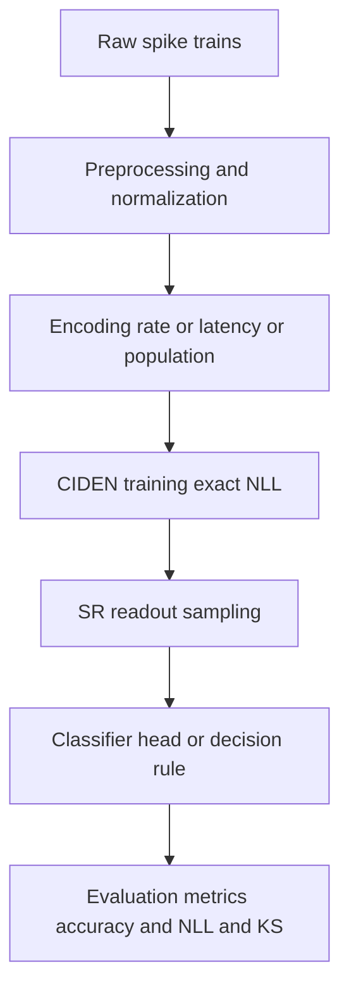
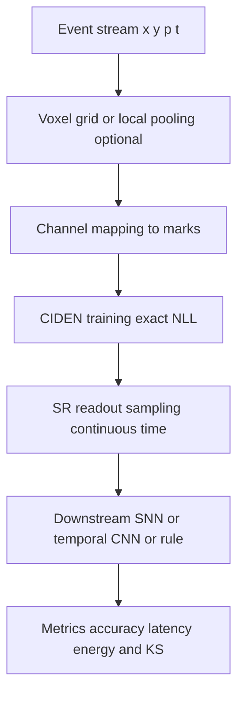
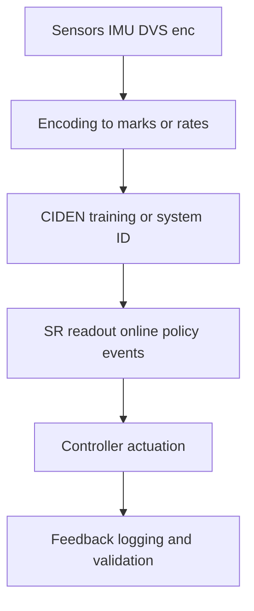

# 10 Applications and Case Studies

Purpose
- Provide end to end blueprints for applying C‑IDEN plus SR readout to temporal pattern recognition, neuromorphic sensing, and robotics control.
- Show pipeline diagrams from data encoding to training, SR inference, and evaluation with reproducibility touchpoints.
- Map each stage to sr_ciden components for traceability.

Key sr_ciden anchors
- Continuous time dynamics and intensity head: [`Python.LinearNonlinearODE()`](src/sr_ciden/dynamics.py:191), [`Python.IntensityHead()`](src/sr_ciden/dynamics.py:346), stable generator [`Python.StableMatrixParam()`](src/sr_ciden/dynamics.py:126), piecewise integration [`Python.integrate()`](src/sr_ciden/dynamics.py:395).
- ODE wrappers and augmented integrals: [`Python.odeint_wrapper()`](src/sr_ciden/solvers.py:298), [`Python.odeint_augmented()`](src/sr_ciden/solvers.py:455).
- Exact marked TPP likelihood: [`Python.nll_continuous()`](src/sr_ciden/losses.py:152).
- SR readout samplers: [`Python.sample_ogata()`](src/sr_ciden/readout.py:152), [`Python.sample_ogata_with_stats()`](src/sr_ciden/readout.py:242), [`Python.sample_bernoulli()`](src/sr_ciden/readout.py:183).
- Time rescaling and K S testing: [`Python.time_rescaling_test()`](src/sr_ciden/validation.py:169).
- PyTorch adapter for training and inference intensity: [`Python.CIDENContinuous()`](src/sr_ciden/adapters/torch.py:36), [`Python.CIDENContinuous.get_intensity_fn()`](src/sr_ciden/adapters/torch.py:191).

--------------------------------------------------------------------------------

## A. Temporal pattern recognition on SHD and SSC

Task
- Classify sequences from Spiking Heidelberg Digits or Spiking Speech Commands into speaker independent classes using continuous time modeling for event streams or binned encodings.

Recommended pipeline

- Encoding
  - Use rate coding per frequency channel or latency code within fixed windows across the spectro temporal representation see 04.
  - When data already arrives as spikes reuse marks for channels.

- Model
  - Hidden dimension H in 32 to 128 with stable generator A = −(αI + LLᵀ) and softplus intensity.

- Training
  - Optimize NLL via [`Python.nll_continuous()`](src/sr_ciden/losses.py:152) and [`Python.odeint_augmented()`](src/sr_ciden/solvers.py:455). For determinism use RK4 fallback in [`Python.odeint_wrapper()`](src/sr_ciden/solvers.py:298).

- Inference
  - Build intensity_fn with [`Python.CIDENContinuous.get_intensity_fn()`](src/sr_ciden/adapters/torch.py:191). Sample with [`Python.sample_ogata()`](src/sr_ciden/readout.py:152) using lam_max selected by a coarse sweep then headroom factor see 07.

- Evaluation
  - Report classification accuracy on a small readout head trained on top of intensity features or directly from sampled spikes via a simple linear temporal classifier.
  - Always report K S p value from [`Python.time_rescaling_test()`](src/sr_ciden/validation.py:169) and average acceptance ratio from [`Python.sample_ogata_with_stats()`](src/sr_ciden/readout.py:242).

--------------------------------------------------------------------------------

## B. Event camera processing on DVS Gesture

Task
- Recognize gestures using DVS streams with polarity channels. The stream is sparse and high resolution in time.

Recommended pipeline

- Encoding
  - Option 1 direct event marks by polarity and spatial tiles. Option 2 voxelize into small windows and use rate coding per tile and polarity see 04.

- Model
  - Use latent ODE with external input provider x t for slowly varying context signals via [`Python.LinearNonlinearODE.set_input_provider()`](src/sr_ciden/dynamics.py:241); keep jumps U for event locked updates via [`Python.JumpMLP()`](src/sr_ciden/dynamics.py:282).

- Inference and interop
  - Generate spikes with SR readout and feed them to a simulator such as Brian2 or to a PyTorch SNN stack snnTorch for downstream layers see 08 and 09.

- Evaluation
  - In addition to accuracy report average latency to first correct decision and energy proxy events processed and multiplier operations. Plot PIT or QQ of rescaled inter event intervals.

--------------------------------------------------------------------------------

## C. Robotics control loop with event driven policies

Objective
- Use intensity modeling to synthesize sparse events that trigger control updates in a low latency loop.

Recommended pipeline

Design notes
- Control update policy
  - Produce events when intensity exceeds a threshold or sample with thinning at modest lam_max to limit compute.
- Latency control
  - Use small windows and keep dt under control for any discrete fallback; SR readout is preferable to avoid binning delay.
- Stability and safety
  - Validate statistical calibration offline before deployment and enforce envelope bounds with runtime monitoring of acceptance ratio and bound violations see 07.

Metrics
- Control error integrated absolute or squared, update rate events per second, actuation latency, and energy budget.

--------------------------------------------------------------------------------

## D. Checklists and implementation steps

General checklist
- Data
  - Inspect time scales and event intensities; determine encoding and mark design.
- Model
  - Choose H K nonlinearity softplus and jump configuration. Initialize stable generator with α in 0.01 to 0.1.
- Training
  - Pick solver backend adjoint if torchdiffeq is installed else RK4 fallback with tuned dt. Track NLL and gradient norms.
- Validation
  - Run time rescaling K S with [`Python.time_rescaling_test()`](src/sr_ciden/validation.py:169) and report p values. Log acceptance ratio and bound violations with [`Python.sample_ogata_with_stats()`](src/sr_ciden/readout.py:242).
- Inference
  - Select lam_max by coarse sweep plus headroom. For discrete fallback calibrate dt to keep probabilities below 1 minus 1e 12.
- Reproducibility
  - Record seeds tolerances and versions see 13.

--------------------------------------------------------------------------------

## E. Planned notebooks

- notebooks/academy/12_app_shd_ssc.ipynb
  - SHD or SSC pipeline with encoding selection exact NLL training SR readout and evaluation.
- notebooks/academy/13_app_dvs_gesture.ipynb
  - DVS gesture pipeline with tile based marks and interop to a downstream SNN.
- notebooks/academy/14_robotics_control_loop.ipynb
  - Closed loop simulation with SR triggered control updates and latency profiling.

Each notebook will cross reference the implementation functions in this repo including [`Python.nll_continuous()`](src/sr_ciden/losses.py:152), [`Python.odeint_augmented()`](src/sr_ciden/solvers.py:455), [`Python.sample_ogata()`](src/sr_ciden/readout.py:152), and [`Python.time_rescaling_test()`](src/sr_ciden/validation.py:169).

--------------------------------------------------------------------------------

## F. Reporting standards

- Always report
  - NLL on held out sequences.
  - K S p value and statistic for time rescaling.
  - Acceptance ratio and bound violations for thinning.
  - Task metric accuracy or control error plus latency to decision when applicable.
  - Energy proxy events processed and rough mul add count or hardware profiler readings if available.

- Visualization
  - Plot intensity trajectories against event rasters, cumulative integral I t, PIT histograms of Δτ, and acceptance ratio traces over time windows.

References
- For citation list see [docs/academy/REFERENCES.md](docs/academy/REFERENCES.md).