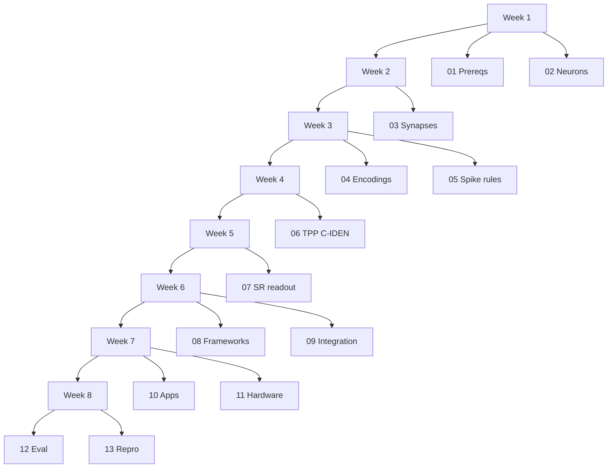

# 14 Learning Pathways

Purpose
- Provide structured, milestone-driven learning tracks tailored to researchers, graduate students, and practitioners.
- Map prerequisite skills to documents, forthcoming notebooks, and sr_ciden components.
- Include self-assessment checkpoints and suggested capstone projects to consolidate learning.

Cross-references
- Top-level plan: [docs/academy/OVERVIEW.md](docs/academy/OVERVIEW.md)
- Prerequisites: [docs/academy/01_prerequisites.md](docs/academy/01_prerequisites.md)
- Neuron models: [docs/academy/02_neuron_models.md](docs/academy/02_neuron_models.md)
- Synapses and plasticity: [docs/academy/03_synapses_plasticity.md](docs/academy/03_synapses_plasticity.md)
- Encodings: [docs/academy/04_temporal_encoding.md](docs/academy/04_temporal_encoding.md)
- Spike learning rules: [docs/academy/05_spike_learning_rules.md](docs/academy/05_spike_learning_rules.md)
- TPP and C‑IDEN theory: [docs/academy/06_tpp_and_ciden_theory.md](docs/academy/06_tpp_and_ciden_theory.md)
- SR readout and thinning: [docs/academy/07_sr_readout_and_thinning.md](docs/academy/07_sr_readout_and_thinning.md)
- Frameworks overview: [docs/academy/08_frameworks_overview_and_comparison.md](docs/academy/08_frameworks_overview_and_comparison.md)
- Integration guides: [docs/academy/09_integration_guides.md](docs/academy/09_integration_guides.md)
- Applications and case studies: [docs/academy/10_applications_and_case_studies.md](docs/academy/10_applications_and_case_studies.md)
- Hardware + energy: [docs/academy/11_hardware_deployment_and_energy.md](docs/academy/11_hardware_deployment_and_energy.md)
- Evaluation metrics: [docs/academy/12_evaluation_metrics.md](docs/academy/12_evaluation_metrics.md)
- Reproducibility and setups: [docs/academy/13_reproducibility_and_setups.md](docs/academy/13_reproducibility_and_setups.md)
- References: [docs/academy/REFERENCES.md](docs/academy/REFERENCES.md)

sr_ciden implementation anchors
- Dynamics and stable A: [`Python.LinearNonlinearODE()`](src/sr_ciden/dynamics.py:191), [`Python.StableMatrixParam()`](src/sr_ciden/dynamics.py:126)
- Augmented ODE integration: [`Python.odeint_augmented()`](src/sr_ciden/solvers.py:455)
- Exact NLL: [`Python.nll_continuous()`](src/sr_ciden/losses.py:152)
- Readout: [`Python.sample_ogata()`](src/sr_ciden/readout.py:152), [`Python.sample_ogata_with_stats()`](src/sr_ciden/readout.py:242), [`Python.sample_bernoulli()`](src/sr_ciden/readout.py:183)
- Validation: [`Python.time_rescaling_test()`](src/sr_ciden/validation.py:169)
- PyTorch adapter: [`Python.CIDENContinuous()`](src/sr_ciden/adapters/torch.py:36), [`Python.CIDENContinuous.get_intensity_fn()`](src/sr_ciden/adapters/torch.py:191)

--------------------------------------------------------------------------------

## A. Tracks and outcomes

- Foundations track (Weeks 1–3)
  - Outcome: Simulate canonical neurons; implement synaptic kernels; understand STDP and surrogate gradients; design encodings.
  - Docs: 01–05. Notebooks to be added: 00–04 (see Next Steps in [docs/academy/OVERVIEW.md](docs/academy/OVERVIEW.md)).
- C‑IDEN + SR track (Weeks 4–5)
  - Outcome: Derive and implement continuous-time marked TPP NLL with augmented ODE; validate with time rescaling; perform SR sampling (Ogata/bernoulli).
  - Docs: 06–07; Implementation mapping to sr_ciden (losses/solvers/dynamics/readout/validation).
- Interoperability track (Week 6)
  - Outcome: Bridge intensities and SR spikes to SNNTorch/Brian2/NEST/Nengo/SpykeTorch.
  - Docs: 08–09; forthcoming notebooks and examples under notebooks/academy/ and examples/frameworks/.
- Applications + Deployment track (Weeks 7–8)
  - Outcome: Build end-to-end pipelines (SHD/SSC, DVS, robotics), and apply hardware/energy practices with standardized evaluation and reproducibility.
  - Docs: 10–13.

--------------------------------------------------------------------------------

## B. Suggested schedule and milestones (8 weeks)

- Week 1: 01, 02
  - Milestone: Implement LIF, QIF, and Izhikevich time-stepped loops; run sanity plots.
- Week 2: 03
  - Milestone: Simulate synaptic kernels and pair-based STDP traces; confirm weight evolution.
- Week 3: 04–05
  - Milestone: Build rate/latency/population encoders; implement a surrogate-gradient toy task (discrete-time).
- Week 4: 06
  - Milestone: Compute exact NLL over segments via [`Python.odeint_augmented()`](src/sr_ciden/solvers.py:455); unit-test a minimal synthetic dataset.
- Week 5: 07
  - Milestone: Ogata thinning with acceptance-ratio logging; compare with discrete-time Bernoulli fallback.
- Week 6: 08–09
  - Milestone: Execute a framework bridge (e.g., SR spikes into Brian2); verify reproducibility and timing alignment.
- Week 7: 10–11
  - Milestone: Build one complete application pipeline and draft a deployment plan with energy profiling hooks.
- Week 8: 12–13
  - Milestone: Produce standardized metrics artifacts and a reproducibility manifest.

--------------------------------------------------------------------------------

## C. Pathways by persona

- Researcher (theory-first)
  - Priority: 06 → 07 → 12 → 10; optionally 08–09 for interop experiments.
  - Deliverable: A paper-ready calibration/evaluation section with K–S p-values and standardized NLL reports.
- Graduate student (balanced)
  - Priority: 01–05 → 06–07 → 08–09 → 10–13.
  - Deliverable: A reproducible project with notebooks, SR sampling, and a framework interop demo.
- Practitioner (deployment-first)
  - Priority: 06–07 → 12–13 → 08–09 → 11 → 10.
  - Deliverable: A compact inference pipeline with SR readout and deployment checklists fulfilled.

--------------------------------------------------------------------------------

## D. Self-assessment checkpoints

Foundations (end of Week 3)
- You can derive LIF/QIF dynamics and implement stable discrete-time simulations.
- You can implement exponential/double-exponential synaptic kernels and pair-based STDP.
- You can design and justify a rate/latency/population/rank-order encoding for a target task.

C‑IDEN + SR (end of Week 5)
- You can derive the marked TPP NLL and implement augmented ODE segments.
- You can implement and validate time rescaling (Δτ vs Exp(1), K–S p-value).
- You can implement Ogata thinning with acceptance-ratio and bound-violation logging.

Interoperability (end of Week 6)
- You can convert intensities or SR spikes into a simulator’s accepted interface.
- You can demonstrate reproducibility (seeded, deterministic) and timing alignment with the target framework.

Applications + Deployment (end of Week 8)
- You can build one end-to-end pipeline (SHD/SSC, DVS, or control) with standardized metrics.
- You can produce a deployment runbook and an energy profiling plan.

--------------------------------------------------------------------------------

## E. Capstone project ideas

- Calibrated auditory digit recognizer
  - Build a pipeline on SHD/SSC from encoding to SR readout; report NLL, K–S p-value, accuracy, acceptance ratio, and latency metrics. Include a reproducibility manifest (see 12 and 13).
- DVS gesture recognizer with hybrid interop
  - Train the intensity model in sr_ciden, generate SR spikes, and inject into Brian2 or snnTorch; quantify the trade-off between continuous-time thinning and discrete-time Bernoulli fallback.
- Low-latency robotics control loop
  - Design a policy triggered by SR events and profile end-to-end latency. Include acceptance ratio tuning via lam_max windowing and report energy proxies.

--------------------------------------------------------------------------------

## F. Mapping to forthcoming notebooks

- 00_prereq_setup.ipynb → Weeks 1–2 bootstrap
- 01_neurons_LIF_QIF_Izhikevich.ipynb → Week 1
- 02_synapses_STDP.ipynb → Week 2
- 03_encoding_strategies.ipynb → Week 3
- 04_surrogate_gradients.ipynb → Week 3 (optional)
- 05_ciden_tpp_training.ipynb → Week 4
- 06_time_rescaling_validation.ipynb → Week 4–5
- 07_sr_readout_ogata_vs_bernoulli.ipynb → Week 5
- 08_frameworks_snntorch_integration.ipynb → Week 6
- 09_brian2_integration.ipynb → Week 6
- 10_nest_nengo_bridge.ipynb → Week 6
- 11_spyketorch_discrete_integration.ipynb → Week 6
- 12_app_shd_ssc.ipynb → Week 7
- 13_app_dvs_gesture.ipynb → Week 7
- 14_robotics_control_loop.ipynb → Week 7
- 15_hardware_loihi_spinnaker.ipynb → Week 8
- 16_energy_quantization_sparsity.ipynb → Week 8
- 17_benchmarking_and_reproducibility.ipynb → Week 8

--------------------------------------------------------------------------------

## G. Minimum competency rubric

- Theory (C‑IDEN, TPPs, Time Rescaling): can derive NLL and explain Δτ ~ Exp(1); references: Hawkes (1971), Brown et al. (2002), Chen et al. (2018).
- Modeling (Latent ODE, Stability, Jumps): can justify A = −(αI + LLᵀ) and design U(x_i, h⁻); references embedded in [docs/academy/06_tpp_and_ciden_theory.md](docs/academy/06_tpp_and_ciden_theory.md).
- Inference (Thinning, Bernoulli): can configure lam_max, analyze acceptance ratios, and ensure determinism; see [docs/academy/07_sr_readout_and_thinning.md](docs/academy/07_sr_readout_and_thinning.md).
- Reproducibility + Evaluation: can produce standardized metrics and manifests; see [docs/academy/12_evaluation_metrics.md](docs/academy/12_evaluation_metrics.md) and [docs/academy/13_reproducibility_and_setups.md](docs/academy/13_reproducibility_and_setups.md).

For canonical citations, see [docs/academy/REFERENCES.md](docs/academy/REFERENCES.md).