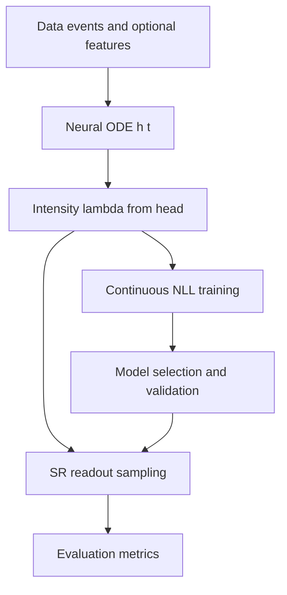

# SNN Academy: Overview and Study Plan
Audience: researchers, graduate students, and practitioners in neuromorphic computing. This suite provides a rigorous blueprint connecting spiking neural network (SNN) theory, temporal point processes (TPPs), and the C-IDEN training plus SR readout pipeline built into sr_ciden.

Purpose
- Establish a peer-review-ready academic resource that unifies SNN fundamentals, continuous-time intensity modeling, and reproducible evaluation.
- Define clear learning tracks from foundations to deployment, mapping theory to the sr_ciden implementation.
- Prepare the ground for notebooks and framework examples to be added next.

Two-stage contract: C-IDEN training and SR readout
- Training (C-IDEN): learn a continuous-time conditional intensity λ*(t) for marked events using a neural ODE hidden state h(t) and exact likelihood. See [`src/sr_ciden/losses.py`](src/sr_ciden/losses.py) via [`Python.nll_continuous()`](src/sr_ciden/losses.py:152), integrators in [`src/sr_ciden/solvers.py`](src/sr_ciden/solvers.py) such as [`Python.odeint_wrapper()`](src/sr_ciden/solvers.py:298) and augmented integration [`Python.odeint_augmented()`](src/sr_ciden/solvers.py:455), and dynamics in [`src/sr_ciden/dynamics.py`](src/sr_ciden/dynamics.py) including [`Python.LinearNonlinearODE()`](src/sr_ciden/dynamics.py:191) and stable A parameterization [`Python.StableMatrixParam()`](src/sr_ciden/dynamics.py:126).
- Inference (SR readout): sample spikes from the learned intensity with Ogata thinning or discrete-time Bernoulli fallback, decoupled from training graphs. See [`src/sr_ciden/readout.py`](src/sr_ciden/readout.py) with [`Python.sample_ogata()`](src/sr_ciden/readout.py:152), [`Python.sample_ogata_with_stats()`](src/sr_ciden/readout.py:242), and [`Python.sample_bernoulli()`](src/sr_ciden/readout.py:183). Goodness-of-fit uses time rescaling and K–S testing in [`src/sr_ciden/validation.py`](src/sr_ciden/validation.py) via [`Python.time_rescaling_test()`](src/sr_ciden/validation.py:169).
- Adapter: a PyTorch-friendly training wrapper and an inference helper live in [`src/sr_ciden/adapters/torch.py`](src/sr_ciden/adapters/torch.py), see [`Python.CIDENContinuous()`](src/sr_ciden/adapters/torch.py:36), [`Python.CIDENContinuous.get_intensity_fn()`](src/sr_ciden/adapters/torch.py:191), and [`Python.SRReadoutTorch()`](src/sr_ciden/adapters/torch.py:260).

Conceptual architecture

Inline references
- Temporal point processes and thinning: Hawkes 1971; Lewis and Shedler 1979; Ogata 1981.
- Time-rescaling theorem and K–S testing: Brown et al. 2002.
- Neural ODEs for continuous-time modeling and adjoint: Chen et al. 2018.
- Plasticity and learning in SNNs: Bi and Poo 1998; Song, Miller and Abbott 2000.
- Surrogate gradients: Neftci, Mostafa and Zenke 2019.
- Frameworks: Brian2 (Stimberg et al. 2019), NEST (Gewaltig and Diesmann 2007), Nengo (Bekolay et al. 2014), SpykeTorch (Mozafari et al. 2019), snnTorch (Eshraghian et al. 2021).

Learning tracks
- Foundations: neuron models, synapses and plasticity, encoding schemes, learning rules.
- CIDEN plus SR-CIDEN: TPPs, Neural ODE hidden dynamics, stable A = -(αI + LLᵀ), exact NLL by augmented integration, time-rescaling validation.
- Frameworks interop: SNNTorch, Brian2, NEST, Nengo, SpykeTorch.
- Applications: temporal recognition, neuromorphic sensors, robotics.
- Deployment and performance: hardware targets, energy, optimization.

Implementation mapping to sr_ciden
- Dynamics and stable generator: [`src/sr_ciden/dynamics.py`](src/sr_ciden/dynamics.py), [`Python.LinearNonlinearODE()`](src/sr_ciden/dynamics.py:191), [`Python.StableMatrixParam()`](src/sr_ciden/dynamics.py:126), [`Python.JumpMLP()`](src/sr_ciden/dynamics.py:282), [`Python.IntensityHead()`](src/sr_ciden/dynamics.py:346), [`Python.integrate()`](src/sr_ciden/dynamics.py:395).
- Solvers and augmented integrals: [`src/sr_ciden/solvers.py`](src/sr_ciden/solvers.py), [`Python.ODESolverConfig()`](src/sr_ciden/solvers.py:86), [`Python.euler_solve()`](src/sr_ciden/solvers.py:144), [`Python.rk4_solve()`](src/sr_ciden/solvers.py:221), [`Python.odeint_wrapper()`](src/sr_ciden/solvers.py:298), [`Python.make_augmented_field()`](src/sr_ciden/solvers.py:391), [`Python.odeint_augmented()`](src/sr_ciden/solvers.py:455).
- Likelihoods: [`src/sr_ciden/losses.py`](src/sr_ciden/losses.py), [`Python.nll_continuous()`](src/sr_ciden/losses.py:152), [`Python.nll_discrete()`](src/sr_ciden/losses.py:388), [`Python.nll()`](src/sr_ciden/losses.py:467).
- SR readout: [`src/sr_ciden/readout.py`](src/sr_ciden/readout.py), [`Python.sample_ogata()`](src/sr_ciden/readout.py:152), [`Python.sample_ogata_with_stats()`](src/sr_ciden/readout.py:242), [`Python.sample_bernoulli()`](src/sr_ciden/readout.py:183).
- Validation: [`src/sr_ciden/validation.py`](src/sr_ciden/validation.py), [`Python.time_rescale()`](src/sr_ciden/validation.py:44), [`Python.ks_test()`](src/sr_ciden/validation.py:126), [`Python.time_rescaling_test()`](src/sr_ciden/validation.py:169).
- PyTorch adapter: [`src/sr_ciden/adapters/torch.py`](src/sr_ciden/adapters/torch.py), [`Python.CIDENContinuous()`](src/sr_ciden/adapters/torch.py:36), [`Python.SRReadoutTorch()`](src/sr_ciden/adapters/torch.py:260).

Prerequisites mapping
- Mathematics: calculus and ODEs, linear algebra, probability with emphasis on point processes and conditional intensity, basic measure-theoretic ideas for TPPs, convex and first order optimization.
- Computing: Python 3, PyTorch tensors and autograd, Jupyter workflows, environment management and reproducibility.
- Optional background: exposure to stochastic processes, control, and numerical analysis.

Recommended 6–8 week study schedule
- Week 1: Prerequisites setup; review neuron models (LIF, QIF, Izhikevich). Read 01 and 02.
- Week 2: Synapses, kernels, and plasticity including STDP and R-STDP. Read 03.
- Week 3: Temporal encodings and learning rules; surrogate gradients overview. Read 04 and 05.
- Week 4: TPPs and C-IDEN theory; NLL derivation; augmented integration. Read 06.
- Week 5: SR readout; Ogata thinning; discrete fallback; acceptance ratio analysis. Read 07.
- Week 6: Frameworks interoperability; plan your target stack. Read 08 and 09.
- Week 7: Applications and hardware deployment; energy-aware design. Read 10 and 11.
- Week 8: Evaluation metrics and reproducibility; finalize a mini project. Read 12, 13, 14.

Document roadmap and cross-links
- 01 Prerequisites: [docs/academy/01_prerequisites.md](docs/academy/01_prerequisites.md)
- 02 Neuron models: [docs/academy/02_neuron_models.md](docs/academy/02_neuron_models.md)
- 03 Synapses and plasticity: [docs/academy/03_synapses_plasticity.md](docs/academy/03_synapses_plasticity.md)
- 04 Temporal encoding: [docs/academy/04_temporal_encoding.md](docs/academy/04_temporal_encoding.md)
- 05 Spike learning rules: [docs/academy/05_spike_learning_rules.md](docs/academy/05_spike_learning_rules.md)
- 06 TPP and C-IDEN theory: [docs/academy/06_tpp_and_ciden_theory.md](docs/academy/06_tpp_and_ciden_theory.md)
- 07 SR readout and thinning: [docs/academy/07_sr_readout_and_thinning.md](docs/academy/07_sr_readout_and_thinning.md)
- 08 Frameworks overview and comparison: [docs/academy/08_frameworks_overview_and_comparison.md](docs/academy/08_frameworks_overview_and_comparison.md)
- 09 Integration guides: [docs/academy/09_integration_guides.md](docs/academy/09_integration_guides.md)
- 10 Applications and case studies: [docs/academy/10_applications_and_case_studies.md](docs/academy/10_applications_and_case_studies.md)
- 11 Hardware deployment and energy: [docs/academy/11_hardware_deployment_and_energy.md](docs/academy/11_hardware_deployment_and_energy.md)
- 12 Evaluation metrics: [docs/academy/12_evaluation_metrics.md](docs/academy/12_evaluation_metrics.md)
- 13 Reproducibility and setups: [docs/academy/13_reproducibility_and_setups.md](docs/academy/13_reproducibility_and_setups.md)
- 14 Learning pathways: [docs/academy/14_learning_pathways.md](docs/academy/14_learning_pathways.md)
- References: [docs/academy/REFERENCES.md](docs/academy/REFERENCES.md)

Next steps: planned notebooks and examples
- notebooks/academy/00_prereq_setup.ipynb — environment, data, seeding, determinism.
- notebooks/academy/01_neurons_LIF_QIF_Izhikevich.ipynb — simulate canonical neurons.
- notebooks/academy/02_synapses_STDP.ipynb — synaptic kernels and STDP variants.
- notebooks/academy/03_encoding_strategies.ipynb — rate, latency, population, rank-order.
- notebooks/academy/04_surrogate_gradients.ipynb — surrogate gradient training patterns.
- notebooks/academy/05_ciden_tpp_training.ipynb — exact NLL with augmented ODE; maps to [`Python.nll_continuous()`](src/sr_ciden/losses.py:152) and [`Python.odeint_augmented()`](src/sr_ciden/solvers.py:455).
- notebooks/academy/06_time_rescaling_validation.ipynb — τ computation and K–S testing via [`Python.time_rescaling_test()`](src/sr_ciden/validation.py:169).
- notebooks/academy/07_sr_readout_ogata_vs_bernoulli.ipynb — Ogata thinning and discrete fallback using [`Python.sample_ogata()`](src/sr_ciden/readout.py:152) and [`Python.sample_bernoulli()`](src/sr_ciden/readout.py:183).
- notebooks/academy/08_frameworks_snntorch_integration.ipynb — PyTorch-based SNN inference mapped from C-IDEN intensities.
- notebooks/academy/09_brian2_integration.ipynb — state-space definitions and event scheduling.
- notebooks/academy/10_nest_nengo_bridge.ipynb — rate and latency interface bridging.
- notebooks/academy/11_spyketorch_discrete_integration.ipynb — batch and time-step discretization.
- notebooks/academy/12_app_shd_ssc.ipynb — auditory temporal recognition pipeline.
- notebooks/academy/13_app_dvs_gesture.ipynb — event camera processing with SR sampling.
- notebooks/academy/14_robotics_control_loop.ipynb — continuous control with intensity-driven events.
- notebooks/academy/15_hardware_loihi_spinnaker.ipynb — deployment flow and constraints.
- notebooks/academy/16_energy_quantization_sparsity.ipynb — energy profiling and reductions.
- notebooks/academy/17_benchmarking_and_reproducibility.ipynb — metrics and standardized reporting.
- examples/frameworks/snntorch_infer.py — use CIDEN intensity with snnTorch layers.
- examples/frameworks/brian2_ciden_rate_bridge.py — map intensities to Brian2 events.
- examples/frameworks/nest_nengo_adapter.py — simple rate or latency bridge to NEST and Nengo.
- examples/frameworks/spyketorch_discrete_readout.py — discretized SR pipeline for SpykeTorch.
- examples/frameworks/torch_ciden_training_loop.py — minimal training loop using [`Python.CIDENContinuous()`](src/sr_ciden/adapters/torch.py:36).

See [docs/academy/REFERENCES.md](docs/academy/REFERENCES.md) for full citations and guidance on verifying publisher and DOI information.